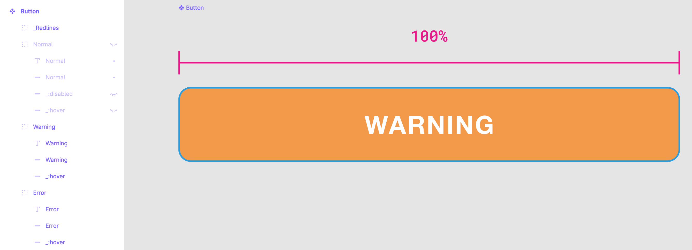
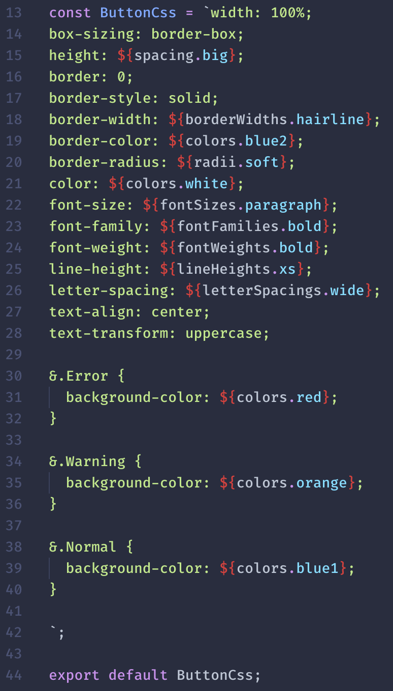
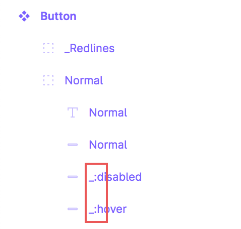

# Figmagic Element Sync

_**Note**: You should pay attention to the expected Figma structure for Element Sync to work. Expect that several features—such as images—are still unsupported. You should definitely still continue to layout your elements/components as they should look in their final state, but understand that the output is likely not 100% complete right after generation, nor will it always work if you do anything unsupported._

## Rationale

Elements are named so because they are primarily meant to help scaffold anything that maps to standard HTML elements like `input`, `button`, `h1`, and `form`. With scaffolding we mean that these elements can be generated as code in a shape that is fitting for _continued_ development—not necessarily final and done, when it arrives steaming hot from your CLI.

Elements are a good entry point both for design and for code generation, since they are relatively simple and as a concept map to HTML which is based on using tags ("elements").

## Flat or nested elements?

You can generate simple **flat** elements or **nested** ones. Use flat elements for anything that is usually less complex (like `hr` and headings like `h1`), and go for nested elements when you want more advanced or “stateful” behavior like being invalid, disabled or if you need subclasses (maybe something like "Warning" and "Error" variants). Open and inspect some of the elements in the [Figmagic template]() to see both patterns! You can make nested elements as deep as you want, but Figmagic will currently only generate code based on the two first nested layers—this is so Figmagic can support the common pattern of Component > Variant > State. Nesting can use either a "subclass" (by having a group), or a pseudo-selector (by using a group prefixed with colon, like ":disabled"). Note that you may mix these as you wish, even something awful like Component > State > State if you need that! :)

Figmagic lets you style elements through **typography** and/or **layout** layers. These are communicated through a text layer (Figma's TEXT layer for typography) and a non-text layer (such as Figma's RECT layer) for layout.

The name of the React component will be taken from the component name. Subclasses and pseudo-selectors will be named by their group name.

_Nesting: Button. "Normal" state. Notice how the underscore is blocking ":disabled" and ":hover"._

_Nesting: Button. "Warning" state._

_Nesting: Button. "Error" state._

_Nesting: Generated code. Notice how the nested group names became CSS classes. Only the differences in those layers were promoted to their own class, eliminating redundant code._

## Describing your element

Further description and element choice is made in the right-hand side Description panel. Click a Figma component in the Figmagic template to see how various elements are set up.

You can write use the following descriptors in Figma's component description field to shape your code generation:

- `description={DESCRIPTION}`: defines the text description that will be output to text/markdown. Example: `description=This is an input element with three variants`.
- `element={ELEMENT}`: defines the actual generated element type. Example: `element=input`.
- `type={TYPE}`: becomes an element property. Useful for complex elements like `input`. Example: `type=checkbox`.
- `placeholder={PLACEHOLDER}`: become text in placeholder property. Example: `placeholder=This is some placeholder text in an input box`.

_Setting what the Figma component should generate in HTML terms. Also, notice how we are typing out the description for our Markdown file which can be used in, for example, Storybook._

### Using pseudo selectors

You can prefix your layer/group with `:` to set/communicate a pseudo-selector (like `:hover`) during code generation.

### Ignore a layer

A `_` (underscore) makes anything prefixed with it ignored during the generation step. Use this for meta-information, redlines or other things you might need to communicate your design, but which should not affect the code generation.

_Prefixing with an underscore means we can avoid the conflict, but still clearly communicate intended behavior and style._

### Tip: Redlines

**Pro tip**: Use a plugin like [Figma Redlines](https://www.figma.com/resources/assets/figma-redlines/) to communicate hard-to-see tokens/features like the padding inside of an Input element. Don’t forget to add a prefixing `_` so Figmagic can safely ignore the redlines.

## Details

- You can provide your own templates through `.figmagicrc`/`.figmagicrc` or the CLI; for expected shape see `/templates` in the Figmagic source code.
- You can skip code generation for any of the 5 generated file types through CLI or `.figmagicrc`/`.figmagicrc`.
- You can pass in `--forceUpdate` to force all generated files to be updated.

For specifics on how to do any CLI or RC file configuration, see documentation below.

_How a Figmagic project could be structured with elements_

### Caveats, issues and gotchas

First and foremost:

_Element Sync will not solve all of your issues and you will have to creatively work around some of the current limitations in Figmagic._
For example, in the case above the check is not in the actual component, as it would not be correctly picked up by Figmagic. In this case, we want to communicate design and intent to developers, but not break the code, thus moving the check out and leaving the rest in. That should solve a lot of the boilerplate work, at least, but the check needs to be added manually afterwards. Assume that you will always need to do some work! Just that it should be a lot less than without Figmagic :)

### Flat elements

_Flat elements should be enough for most basic use cases. Don't forget to name the layout layer to the same name as your Figma component or it will break during generation!_

- Don’t use more than one object with a fill in an element (you will get only one background/background-color!).
- Elements are not self-closing (i.e. they are always `<element></element>` rather than `<element />`).
- Cannot combine groups AND flat/non-nested styling inside an element.
- Linear gradient is supported, but it does not use "gradientHandlePositions”.

#### Nested elements

- CSS output can be wonky if you don’t use at least 2 different ”variants” or ”states” in your nested component — try using regular non-nested components/elements when you don’t actually have multiple variants.
- Layer order matters in nested elements! It will always pick the first layout or text element it finds.
- Currently only a single layout element per group/nested layer will be picked up.
- Nested elements should ideally have a text element in order to avoid breaking or getting strange CSS/behavior. This layer does not have to be visible!

#### Incomplete list of things that are not yet supported

- Gradients (Linear Gradient is the only gradient type which is currently supported)
- Layout constraints
- Layout grid
- Images
- Blend modes
